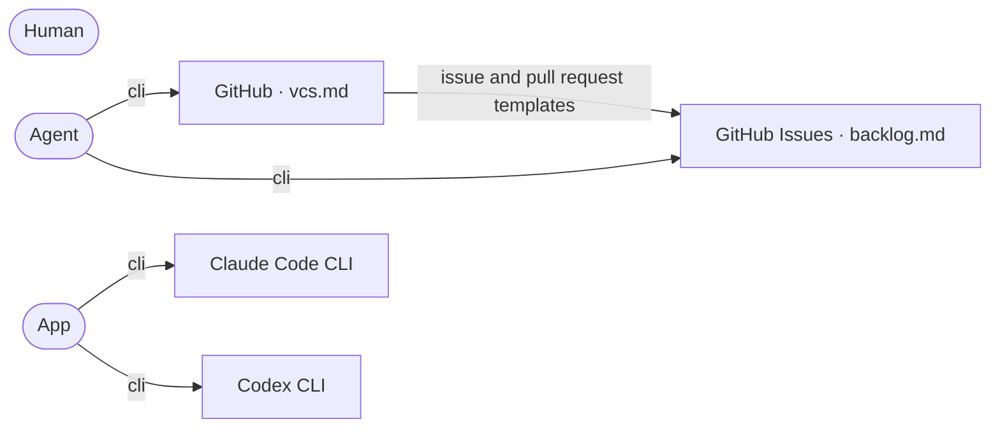

# Ecosystem

```mermaid
flowchart LR
  Human([Human])
  Agent([Agent])
  App([App])
  Vcs["GitHub · vcs.md"]
  Tracker["GitHub Issues · backlog.md"]
  Claude["Claude Code CLI"]
  Codex["Codex CLI"]

  Agent -- cli --> Vcs
  Agent -- cli --> Tracker
  App -- cli --> Claude
  App -- cli --> Codex
  Vcs -- "issue and pull request templates" --> Tracker
```
